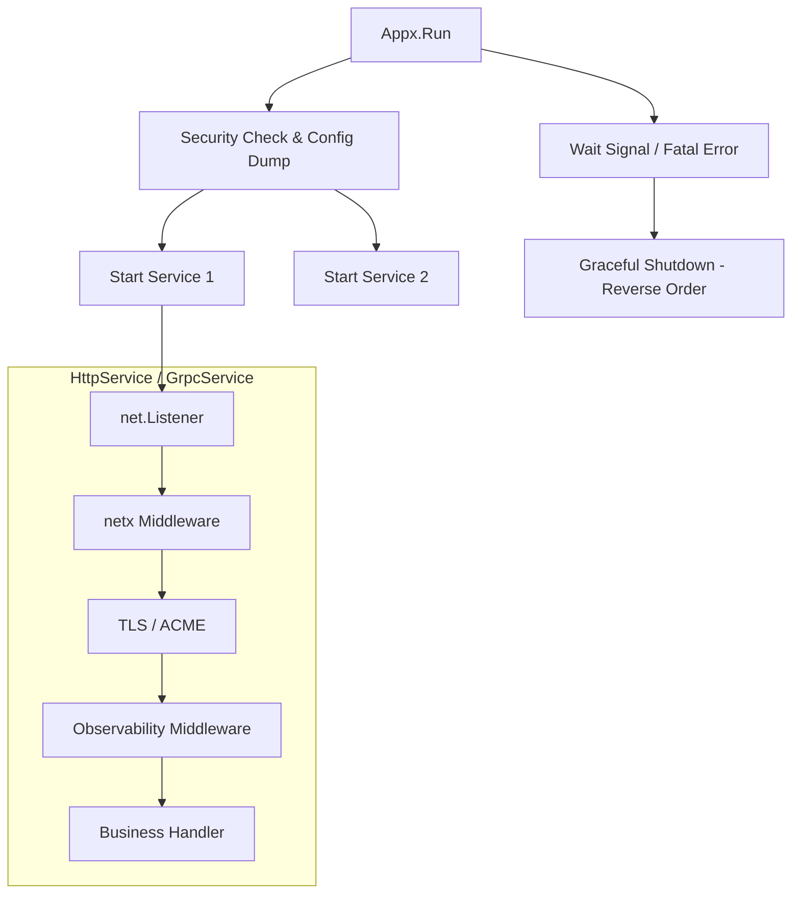

# Appx: Production-Ready Application Container

[](https://goreportcard.com/report/appx)
[](https://opensource.org/licenses/MIT)

[中文](./README.zh.md) | [English](./README.md)

`appx` is a **service container** designed for building production-grade Go applications.

It is more than just an HTTP/gRPC launcher; it is a **lifecycle manager**. It orchestrates the startup order, graceful shutdown, health checks, and underlying network enhancements (such as rate limiting, circuit breaking, and HTTP/3) for multiple services (HTTP, gRPC, Background Tasks, Cron).

It deeply integrates `netx` (network enhancements), `o11y` (observability), and `cert` (certificate management), aiming to let you write SRE-standard services with minimal code.

## Core Features

*   **Unified Lifecycle**: Manages the Start/Stop of all components, supporting startup rollbacks and graceful shutdown timeout control.
*   **Multi-Protocol**:
    *   **HTTP/1.1 & HTTP/2**: Enabled by default.
    *   **HTTP/3 (QUIC)**: One-click activation, automatically handles UDP listening and `Alt-Svc` header injection.
    *   **gRPC**: Integrated with OpenTelemetry interceptors and Panic recovery.
*   **Network Enhancements (Powered by netx)**:
    *   **Connection Protection**: Limits maximum concurrent connections (MaxConns) to prevent OOM.
    *   **Anti-Slowloris**: Automated IO Timeout configuration.
    *   **High Performance**: Supports `SO_REUSEPORT` to improve multi-core throughput.
*   **Zero-Config Observability**:
    *   Simply pass `o11y.Config` to automatically inject Tracing middleware, Access Logs, and Metrics.
    *   Built-in `/healthz` and `/metrics` endpoints.
*   **Security Self-Check**: Automatically checks for high-risk configurations (e.g., running as Root, weak passwords, file permissions) upon startup.

## Installation

```bash
go get appx
```

## Quick Start

### 1. Basic HTTP Service

```go
package main

import (
    "net/http"
    "appx"
    "github.com/rs/zerolog/log"
)

func main() {
    // 1. Create the container
    app := appx.New(appx.WithLogger(&log.Logger))

    // 2. Define business routes
    mux := http.NewServeMux()
    mux.HandleFunc("/", func(w http.ResponseWriter, r *http.Request) {
        w.Write([]byte("Hello Appx!"))
    })

    // 3. Add HTTP Service
    // Automatically gains: Graceful Shutdown, MaxConns Limit, KeepAlive
    app.Add(appx.NewHttpService("api", ":8080", mux))

    // 4. Run (blocks until interrupt signal)
    if err := app.Run(); err != nil {
        log.Fatal().Err(err).Msg("Appx crashed")
    }
}
```

### 2. Full-Featured Example (HTTP/3 + gRPC + Metrics)

```go
func main() {
    // Load config...
    cfg := loadConfig()
    
    // Initialize Observability
    o11y.Init(cfg.O11y)

    // Create container, inject security manager
    app := appx.New(
        appx.WithSecurityManager(security.New(&log.Logger)),
        appx.WithShutdownTimeout(10 * time.Second),
    )

    // --- A. Add Monitor Service (:9090) ---
    // Expose /metrics (Prometheus) and /healthz
    monitorAuth := func(ctx context.Context, user, pass string) (any, error) {
		if user == "admin" && pass == "s3cret" {
			return "admin", nil
		}
		return nil, fmt.Errorf("invalid credentials")
	} // Simple auth middleware
    app.Add(appx.NewMonitorService(":9090", app.HealthHandler(), httpx.AuthBasic(monitorAuth, "Monitor Area")))

    // --- B. Add Main API Service (:8443) ---
    apiSvc := appx.NewHttpService("main-api", ":8443", httpHandler).
        WithMaxConns(10000).        // Rate limiting protection
        WithReusePort().            // Performance optimization
        WithObservability(cfg.O11y) // Auto-inject Trace/Log/Metric

    // Enable HTTPS and HTTP/3
    if certMgr, err := cert.New(cfg.Cert, nil); err == nil {
        apiSvc.WithTLS(certMgr).WithHTTP3()
    }
    app.Add(apiSvc)

    // --- C. Add gRPC Service (:50051) ---
    grpcServer := grpc.NewServer()
    // ... Register PB ...
    app.Add(appx.NewGrpcService("user-rpc", ":50051", grpcServer))

    // --- D. Add Background Tasks ---
    runner := task.NewRunner()
    app.Add(appx.NewTaskService(runner))

    // Start all services
    app.Run()
}
```

## Architecture Design

The Appx uses an **Onion Model** to build the network layer and provides unified control at the application layer:



## Component Details

### `HttpService`
Standard Web service wrapper.
- **WithHTTP3()**: Enables QUIC support. Note that HTTP/3 must be used with `WithTLS`.
- **WithReusePort()**: Enables `SO_REUSEPORT`. Recommended for multi-core environments like Kubernetes.

### `GrpcService`
gRPC service wrapper. Automatically handles `net.Listen` and enhances connection properties (e.g., timeout control) via `netx`.

### `MonitorService`
A lightweight HTTP service dedicated to exposing OPS interfaces:
- `/metrics`: Prometheus metrics.
- `/healthz`: Aggregated status of all registered `HealthChecker`s.
- `/debug/pprof`: Go profiling tools.

### `TaskService`
Integrates `github.com/oy3o/task` into the Appx lifecycle. Ensures the Appx waits for all background tasks to drain before exiting.

## Interface Definition

Implement these to integrate custom components into the Appx:

```go
type Service interface {
    Name() string
    // Non-blocking start
    Start(ctx context.Context) error
    // Blocks until stopped
    Stop(ctx context.Context) error
}

type HealthChecker interface {
    Name() string
    Check(ctx context.Context) error
}
```
