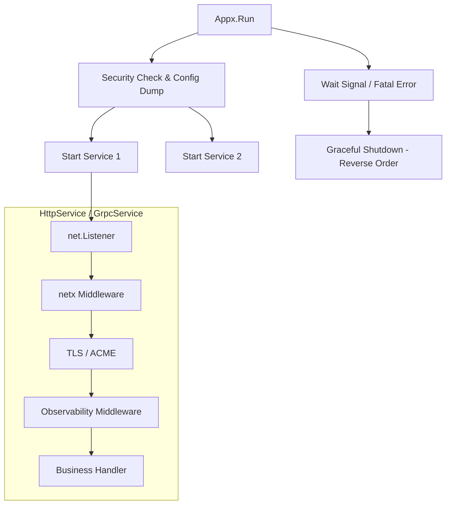

# Appx: Production-Ready Application Container

[](https://goreportcard.com/report/github.com/oy3o/appx)
[](https://opensource.org/licenses/MIT)

[中文](./README.zh.md) | [English](./README.md)

`appx` 是一个用于构建生产级 Go 应用的**服务容器**。

它不仅仅是一个 HTTP/gRPC 启动器，而是一个**生命周期管理器**。它负责编排多个服务（HTTP, gRPC, Background Tasks, Cron）的启动顺序、优雅关闭、健康检查以及底层网络增强（如限流、熔断、HTTP/3）。

它深度集成了 `netx` (网络增强), `o11y` (可观测性), 和 `cert` (证书管理)，旨在让你用极少的代码写出符合 SRE 标准的服务。

## 核心特性

*   **统一生命周期 (Lifecycle)**: 管理所有组件的 Start/Stop，支持启动回滚和优雅关闭超时控制。
*   **多协议栈 (Multi-Protocol)**:
    *   **HTTP/1.1 & HTTP/2**: 默认开启。
    *   **HTTP/3 (QUIC)**: 一键开启，自动处理 UDP 监听和 `Alt-Svc` 头注入。
    *   **gRPC**: 集成 OpenTelemetry 拦截器和 Panic 恢复。
*   **网络增强 (Powered by netx)**:
    *   **连接保护**: 限制最大并发连接数 (MaxConns)，防止 OOM。
    *   **抗慢速攻击**: 自动配置 IO Timeout。
    *   **高性能**: 支持 `SO_REUSEPORT`，提升多核吞吐。
*   **零配置可观测性**:
    *   只需传入 `o11y.Config`，自动注入 Tracing 中间件、Access Log 和 Metrics。
    *   内置 `/healthz` 和 `/metrics` 端点。
*   **安全自检**: 启动时自动检查高危配置（如 Root 运行、弱密码、文件权限）。

## 安装

```bash
go get appx
```

## 快速开始

### 1. 基础 HTTP 服务

```go
package main

import (
    "net/http"
    "appx"
    "github.com/rs/zerolog/log"
)

func main() {
    // 1. 创建容器
    app := appx.New(appx.WithLogger(&log.Logger))

    // 2. 定义业务路由
    mux := http.NewServeMux()
    mux.HandleFunc("/", func(w http.ResponseWriter, r *http.Request) {
        w.Write([]byte("Hello Appx!"))
    })

    // 3. 添加 HTTP 服务
    // 自动获得：Graceful Shutdown, MaxConns Limit, KeepAlive
    app.Add(appx.NewHttpService("api", ":8080", mux))

    // 4. 运行 (阻塞直到信号中断)
    if err := app.Run(); err != nil {
        log.Fatal().Err(err).Msg("Appx crashed")
    }
}
```

### 2. 全功能示例 (HTTP/3 + gRPC + Metrics)

```go
func main() {
    // 加载配置...
    cfg := loadConfig()
    
    // 初始化可观测性
    o11y.Init(cfg.O11y)

    // 创建容器，注入安全检查
    app := appx.New(
        appx.WithSecurityManager(security.New(&log.Logger)),
        appx.WithShutdownTimeout(10 * time.Second),
    )

    // --- A. 添加 Monitor 服务 (:9090) ---
    // 暴露 /metrics (Prometheus) 和 /healthz
    monitorAuth := func(ctx context.Context, user, pass string) (any, error) {
		if user == "admin" && pass == "s3cret" {
			return "admin", nil
		}
		return nil, fmt.Errorf("invalid credentials")
	} // 简单的认证中间件
    app.Add(appx.NewMonitorService(":9090", app.HealthHandler(), httpx.AuthBasic(monitorAuth, "Monitor Area")))

    // --- B. 添加主 API 服务 (:8443) ---
    apiSvc := appx.NewHttpService("main-api", ":8443", httpHandler).
        WithMaxConns(10000).        // 限流保护
        WithReusePort().            // 性能优化
        WithObservability(cfg.O11y) // 自动注入 Trace/Log/Metric

    // 启用 HTTPS 和 HTTP/3
    if certMgr, err := cert.New(cfg.Cert, nil); err == nil {
        apiSvc.WithTLS(certMgr).WithHTTP3()
    }
    app.Add(apiSvc)

    // --- C. 添加 gRPC 服务 (:50051) ---
    grpcServer := grpc.NewServer()
    // ... 注册 PB ...
    app.Add(appx.NewGrpcService("user-rpc", ":50051", grpcServer))

    // --- D. 添加后台任务 ---
    runner := task.NewRunner()
    app.Add(appx.NewTaskService(runner))

    // 启动所有服务
    app.Run()
}
```

## 架构设计

Appx 采用**洋葱模型**构建网络层，并在应用层提供统一管控：



## 组件详解

### `HttpService`
标准的 Web 服务封装。
- **WithHTTP3()**: 开启 QUIC 支持。注意 HTTP/3 必须配合 `WithTLS` 使用。
- **WithReusePort()**: 开启 `SO_REUSEPORT`。在 Kubernetes 等多核环境下建议开启。

### `GrpcService`
gRPC 服务封装。会自动处理 `net.Listen` 并通过 `netx` 增强连接属性（如超时控制）。

### `MonitorService`
一个轻量级的 HTTP 服务，专门用于暴露运维接口：
- `/metrics`: Prometheus 指标。
- `/healthz`: 聚合了所有注册的 `HealthChecker` 的状态。
- `/debug/pprof`: Go 性能分析工具。

### `TaskService`
将 `github.com/oy3o/task` 集成到 Appx 生命周期中。确保 Appx 退出时，等待所有后台任务执行完毕（Drain）。

## 接口定义

实现自定义组件接入 Appx：

```go
type Service interface {
    Name() string
    // 非阻塞启动
    Start(ctx context.Context) error
    // 阻塞直到停止
    Stop(ctx context.Context) error
}

type HealthChecker interface {
    Name() string
    Check(ctx context.Context) error
}
```
